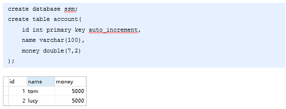
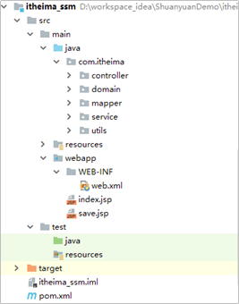
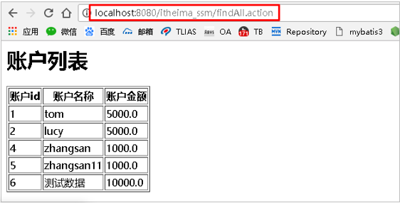

### SSM框架整合

#### 1.1 原始方式整合

##### 1.准备工作




##### 2.创建Maven工程




##### 3.导入Maven坐标

参考：**素材/配置文件/pom.xml文件**

##### 4.编写实体类

```java
public class Account {
    private int id;
    private String name;
    private double money;
    //省略getter和setter方法
}
```

##### 5.编写Mapper接口

```java
public interface AccountMapper {
    //保存账户数据
    void save(Account account);
    //查询账户数据
    List<Account> findAll();
}
```


##### 6.编写Service接口

```java
public interface AccountService {
    void save(Account account); //保存账户数据
    List<Account> findAll(); //查询账户数据
}
```


##### 7.编写Service接口实现

```java
@Service("accountService")
public class AccountServiceImpl implements AccountService {
    public void save(Account account) {
        SqlSession sqlSession = MyBatisUtils.openSession();
        AccountMapper accountMapper = sqlSession.getMapper(AccountMapper.class);
        accountMapper.save(account);
        sqlSession.commit();
        sqlSession.close();
    }
    public List<Account> findAll() {
        SqlSession sqlSession = MyBatisUtils.openSession();
        AccountMapper accountMapper = sqlSession.getMapper(AccountMapper.class);
        return accountMapper.findAll();
    }
}
```


##### 8.编写Controller

```java
@Controller
public class AccountController {
    @Autowired
    private AccountService accountService;
    @RequestMapping("/save")
    @ResponseBody
    public String save(Account account){
        accountService.save(account);
        return "save success";
    }
    @RequestMapping("/findAll")
    public ModelAndView findAll(){
        ModelAndView modelAndView = new ModelAndView();
        modelAndView.setViewName("accountList");
        modelAndView.addObject("accountList",accountService.findAll());
        return modelAndView;
    }
}
```


##### 9.编写添加页面

```html
<%@ page contentType="text/html;charset=UTF-8" language="java" %>
<html>
<head>
    <title>Title</title>
</head>
<body>
    <h1>保存账户信息表单</h1>
    <form action="${pageContext.request.contextPath}/save.action" method="post">
        用户名称<input type="text" name="name"><br/>
        账户金额<input type="text" name="money"><br/>
        <input type="submit" value="保存"><br/>
    </form>
</body>
</html>
```


##### 10.编写列表页面

```html
<table border="1">
    <tr>
        <th>账户id</th>
        <th>账户名称</th>
        <th>账户金额</th>
    </tr>
    <c:forEach items="${accountList}" var="account">
        <tr>
            <td>${account.id}</td>
            <td>${account.name}</td>
            <td>${account.money}</td>
        </tr>
    </c:forEach>
</table>
```


##### 11.编写相应配置文件(文件参考目录：素材/配置文件)

•Spring配置文件：[applicationContext.xml](配置文件/applicationContext.xml)

•SprngMVC配置文件：[spring-mvc.xml](配置文件/spring-mvc.xml)

•MyBatis映射文件：[AccountMapper.xml](配置文件/AccountMapper.xml)

•MyBatis核心文件：[sqlMapConfig.xml](配置文件/sqlMapConfig.xml)

•数据库连接信息文件：[jdbc.properties](配置文件/jdbc.properties)

•Web.xml文件：[web.xml](配置文件/web.xml)

•日志文件：[log4j.xml](

##### 12.测试添加账户


##### 13.测试账户列表



#### 1.2 Spring整合MyBatis

##### 1.整合思路


##### 2.将SqlSessionFactory配置到Spring容器中

```xml
<!--加载jdbc.properties-->
<context:property-placeholder location="classpath:jdbc.properties"/>
<!--配置数据源-->
<bean id="dataSource" class="com.mchange.v2.c3p0.ComboPooledDataSource">
    <property name="driverClass" value="${jdbc.driver}"/>
    <property name="jdbcUrl" value="${jdbc.url}"/>
    <property name="user" value="${jdbc.username}"/>
    <property name="password" value="${jdbc.password}"/>
</bean>
<!--配置MyBatis的SqlSessionFactory-->
<bean id="sqlSessionFactory" class="org.mybatis.spring.SqlSessionFactoryBean">
    <property name="dataSource" ref="dataSource"/>
    <property name="configLocation" value="classpath:sqlMapConfig.xml"/>
</bean>
```


##### 3.扫描Mapper，让Spring容器产生Mapper实现类

```xml
<!--配置Mapper扫描-->
<bean class="org.mybatis.spring.mapper.MapperScannerConfigurer">
    <property name="basePackage" value="com.itheima.mapper"/>
</bean>
```


##### 4.配置声明式事务控制

```xml
<!--配置声明式事务控制-->
<bean id="transacionManager" class="org.springframework.jdbc.datasource.DataSourceTransactionManager">
    <property name="dataSource" ref="dataSource"/>
</bean>
<tx:advice id="txAdvice" transaction-manager="transacionManager">
    <tx:attributes>
        <tx:method name="*"/>
    </tx:attributes>
</tx:advice>
<aop:config>
    <aop:pointcut id="txPointcut" expression="execution(* com.itheima.service.impl.*.*(..))"/>
    <aop:advisor advice-ref="txAdvice" pointcut-ref="txPointcut"/>
</aop:config>
```


##### 5.修改Service实现类代码

```java
@Service("accountService")
public class AccountServiceImpl implements AccountService {

    @Autowired
    private AccountMapper accountMapper;

    public void save(Account account) {
        accountMapper.save(account);
    }
    public List<Account> findAll() {
        return accountMapper.findAll();
    }
}
```

